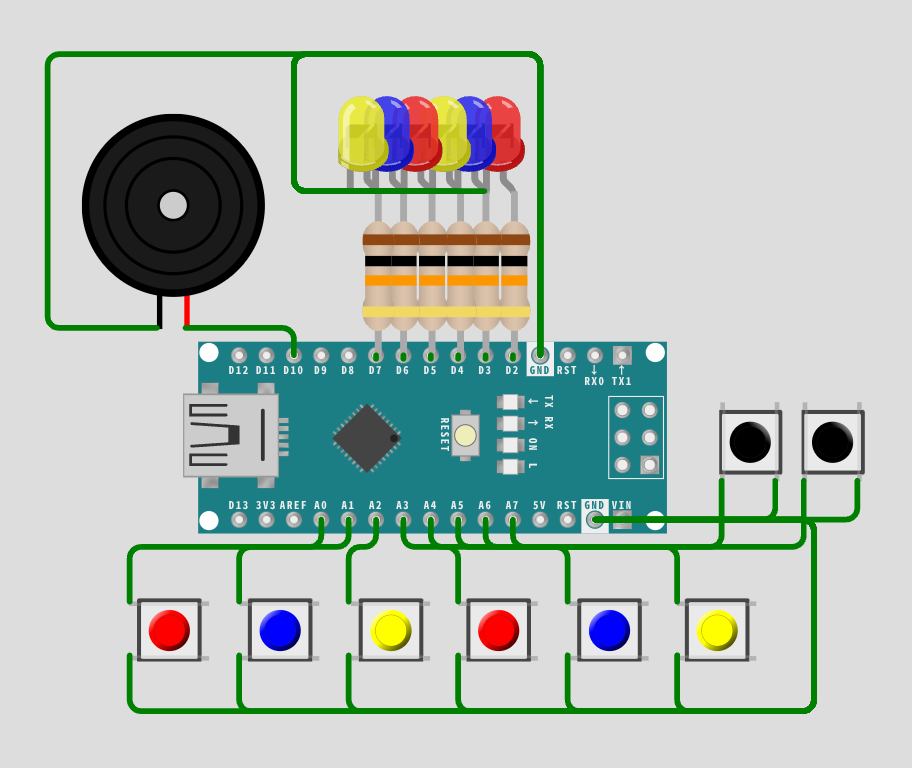

# quick-buzzer

## 概要
このリポジトリはArduino Mega 2560上で動作する早押し機を製作するのに作成・引用したソースコードとそれに必要なファイルです。
このリポジトリのソースコードはChat GPTによって作成されました。

## ファイル構成
```
quick-buzzer
├── pushed.h         - ボタン押下音のオーディオデータ
├── correct.h        - 正解音のオーディオデータ
├── incorrect.h      - 不正解音のオーディオデータ
├── main.ino         - メインプログラム
├── audio_player.h   - オーディオプレイヤーヘッダー
├── audio_player.cpp - オーディオプレイヤー実装
├── usbconfig.h      - USBの設定ファイル
├── pins.yml         - ピン割り当てのメモ
├── prompt.txt       - ソースコードのコーディングのプロンプトの文章
├── LICENSE
└── README.md

libraries
└── VUSB             - V-USB ライブラリ
```

## 使用するソフト
- [Arduino Web Editor](https://create.arduino.cc/editor)
- [Wav2C](https://guilhermerodrigues680.github.io/wav2c-online)

## 使用するライブラリ
- [V-USB](https://github.com/obdev/v-usb)

## 使用した音源
- [効果音ラボ](https://soundeffect-lab.info/)
- [OtoLogic](https://otologic.jp/)

## 回路


## 使用方法
1. 本体を起動
2. ボタンを押して早押し機能を使用
3. ボタン押下時にブザーで押下音が再生される
4. 正解/不正解ボタンを押すと、対応する音声がブザーで再生される

## 実物写真


## スケッチ
[Arduino Web Editor - quick-buzzer](https://app.arduino.cc/sketches/8df1547e-1683-44ad-8725-f67bf0925067?view-mode=preview)
